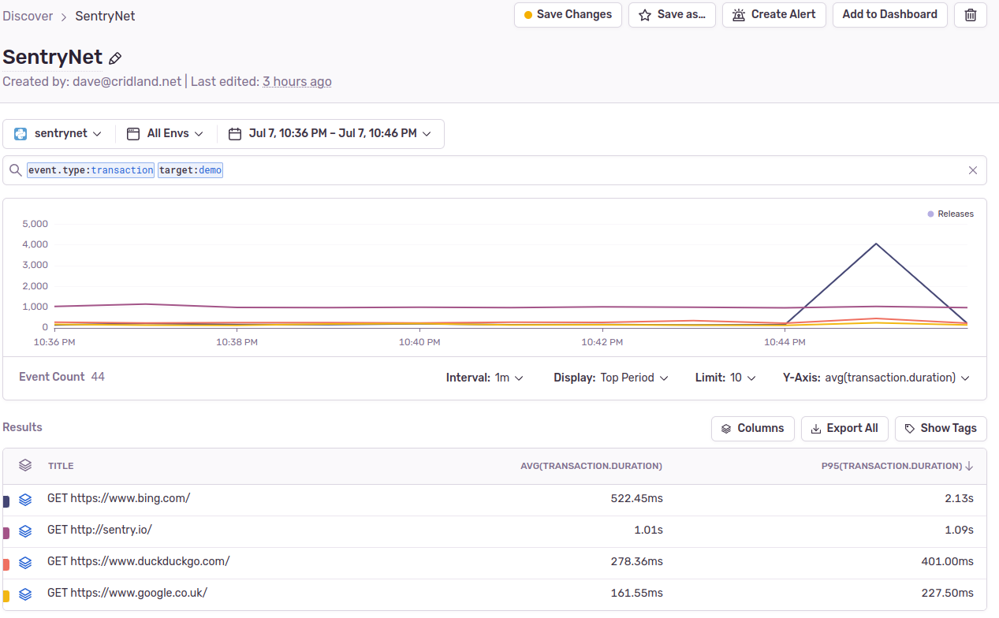
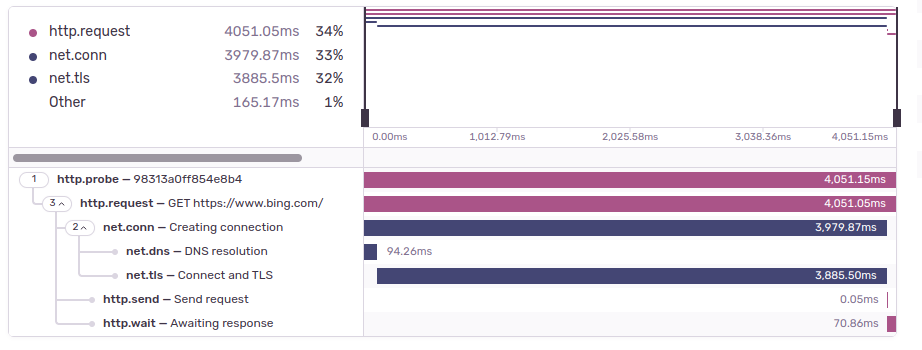

# SentryNet
#### Abusing Sentry into an Uptime/Responsivity Monitor

### What's it do?

SentryNet is a smallish chunk of Python which probes your services in various ways, dumping errors and telemetry into Sentry.

THRILL! To graphs of response times.



GASP! At breakdowns of the probe trace.



BE DISAPPOINTED! At errors if your services are unreachable.

Obviously I'd put a screenshot here, too, but all my services are perfect and never get downtime.

You'll need:
* A Sentry account, or a self-hosted Sentry deployment.
* One or (ideally) several more places you can run a bit of Python.
* Something to monitor, ideally itself already using Sentry.

### Configuration

SentryNet is configured by a simply YAML file.

It has two sections:

#### Sentry Configuration

The `sentry` top level key contains two sub-keys:
* `dsn` - you'll want to create a new Project in Sentry and put the DSN here.
* `tags` - all subkeys of this will be put as tags against all transactions and events in Sentry. Pick anything (or nothing) you want.

Example:
```yaml
sentry:
  dsn: https://3641121feabb3b0fb5798fba2ae4e215@sentry.cridland.io/238947
  tags:
    location: mission-control
    another.tag: value
```

#### Probe Group Configuration

The only other top-level key is `groups`, which contains a list of probe groups.

These just have another set of `tags` and a list of `probes`.

```yaml
groups:
    - tags:
        target: demo
      probes:
      - probe: probes.http
        url: https://www.google.co.uk/
        every: 30
      - probe: probes.http
        url: https://www.bing.com/
        every: 60
        burst: 4
      - probe: probes.http
        url: https://www.duckduckgo.com/
      - probe: probes.http
        url: http://sentry.io/
```

#### Probe Configuration

These require, at minimum, a `probe` key, which simply points to the Python module that implements the probe.

Optionally, they can include `every` - which gives the period in seconds - and `burst`, which is how many to do  each time. Bursts are consecutive not concurrent.

### Probe Types

### probes.http

The only defined type right now is a relatively simple HTTP probe. It'll do a GET on the URL you give, and check the status code it gets back. This uses two additional keys in the `probe` definition:

* `url` - the (mandatory) URL to probe.
* `expected` - the status code we expect, defaulting to `200`.

### Usage

Once configured and running, it will simply emit transaction (and error) events to Sentry for its configured Project.

The usual Issues and Performance sections will work as usual, though errors here are (hopefully!) relating to the target of the probe and not SentryNet itself.

You can also build Discover queries and Dashboard out of the data, hopefully quite easily.

The trick to using it effectively is to tag effectively so you can slice the data as needed.
